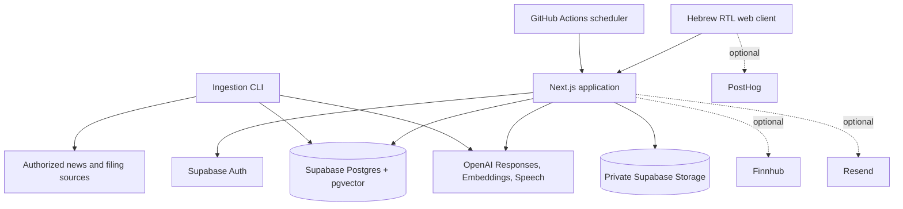

<p align="center">
  
</p>

<h1 align="center">Vestory by Slinon</h1>

<p align="center">
  A personalized Hebrew financial-audio platform that turns a portfolio,
  watchlist, and investment interests into short, sourced podcast briefings.
</p>

<p align="center">
  <a href="https://www.slinon.me">Website</a> ·
  <a href="https://www.slinon.me/vestory_app">Vestory app</a> ·
  <a href="https://www.slinon.me/demo">Interactive demo</a> ·
  <a href="https://www.slinon.me/trust">Trust and sources</a>
</p>

## Overview

Vestory helps Hebrew-speaking users follow the financial subjects that matter
to them without manually scanning multiple feeds. A user confirms tracked
assets and interests, chooses a daily or weekly schedule, and receives a
chapter-based Hebrew podcast with source links and an explanation of why each
story is relevant.

The repository contains the production application, its public marketing
experience, the ingestion and podcast pipelines, database migrations,
operational workflows, and a broad regression suite.

Vestory is an informational product. It does not provide investment advice,
trading instructions, price targets, or professional financial services.

## Product capabilities

- Email/password authentication, email confirmation, password recovery, and
  provider-based OAuth through Supabase Auth.
- Per-user portfolios, watchlists, custom interests, schedules, notification
  preferences, onboarding drafts, and podcast history.
- Free-text and screenshot-assisted portfolio onboarding with deterministic
  fallback parsing and structured AI classification.
- Alias, typo, Hebrew/English, Israeli-security-number, index, and crypto
  recognition with confirmation before profile storage.
- Daily or weekly podcasts scheduled in `Asia/Jerusalem`, plus on-demand
  generation from the application.
- Semantic retrieval from an indexed, source-backed knowledge store.
- Structured Hebrew script generation, source-integrity checks, prohibited
  advice detection, fact verification, corrective retries, and safe repair of
  unsupported passages.
- Per-chapter speech synthesis, combined MP3 output, private object storage,
  HTTP range streaming, chapter navigation, speed controls, and downloads.
- Source views, personalized relevance labels, history, and full episode
  detail pages.
- Optional ready-email delivery, market quotes and logos, product analytics,
  and privacy-masked session replay.

## System architecture



The production application is a Next.js 16 modular monolith using React 19 and
TypeScript. Server route handlers own authentication, data access, generation,
scheduling, and streaming. Supabase provides authentication, PostgreSQL,
pgvector, and private audio storage. OpenAI provides structured classification,
embeddings, script generation, verification, and speech synthesis.

### Podcast generation flow

1. The user confirms holdings, watchlist entries, and interests.
2. The server stores a validated, per-user profile and computes the next run.
3. A separate ingestion process discovers and extracts authorized source
   material, deduplicates it, chunks it, embeds it, and stores source metadata.
4. Generation retrieves the most relevant documents for the user's profile and
   selected daily or weekly time window.
5. OpenAI produces a bounded Hebrew script that cites only retrieved item IDs.
6. Local checks reject unknown citations, direct advice, and Latin-script text
   that would be mispronounced by Hebrew speech synthesis.
7. A verification model checks factual support. Failed passages receive one
   corrective retry and then a narrow, safe repair instead of silently shipping
   unsupported content.
8. Chapters are synthesized, combined, uploaded to private storage, and exposed
   through authenticated byte-range streaming endpoints.
9. The completed episode appears on Today and in History; scheduled episodes
   can trigger a ready email near the requested delivery time.

OpenAI requests use `store: false`. Generation does not perform an expensive
live crawl; it reads the latest successfully indexed knowledge snapshot and
fails safely when no verified material is available.

## Technology

| Area | Implementation |
| --- | --- |
| Application | Next.js 16, React 19, TypeScript 5.9 |
| UI | Hebrew RTL interface, Tailwind CSS 4, Base UI, shadcn primitives |
| Authentication | Supabase Auth and `@supabase/ssr` cookie sessions |
| Data | Supabase Postgres, Row Level Security, pgvector |
| Audio | OpenAI Speech API, MP3 chapter assembly, Supabase Storage |
| AI | OpenAI Responses API, structured outputs, embeddings, verification |
| Ingestion | XML discovery, SEC EDGAR, Decodo, Firecrawl, ScraperAPI |
| Operations | Vercel, GitHub Actions, protected scheduler and keepalive routes |
| Optional services | Resend, Finnhub, PostHog |
| Quality | Vitest, ESLint, TypeScript |

## Repository layout

```text
slinon/
├── product/                       # Production full-stack application
│   ├── app/                       # Pages, auth callback, and API handlers
│   ├── components/                # Product screens and reusable UI
│   ├── db/                        # Server-only Supabase clients and queries
│   ├── lib/
│   │   ├── ingestion/             # Discovery, extraction, ranking, chunking
│   │   └── podcast/               # Retrieval, generation, verification, audio
│   ├── public/                    # Deployed static marketing/about assets
│   ├── scripts/                   # Database, ingestion, and migration tools
│   ├── supabase/migrations/       # Canonical ordered database migrations
│   └── tests/                     # Product and ingestion tests
├── tests/                         # Repository-wide regression suite
├── marketing_page/                # Source for the public product website
├── on_slinon_page/                # Source for the Slinon company page
├── ui_vestory_web_app/            # Preserved standalone UI prototype
└── .github/workflows/             # Scheduler and Supabase keepalive jobs
```

`product/` is the deployed application. The other top-level web directories
preserve source material and earlier interface work; they are not independent
production services.

## Data model

The schema is built from the ordered migrations in
[`product/supabase/migrations`](product/supabase/migrations). Major groups are:

- **Identity and preferences:** `profiles`, `settings`, `onboarding_draft`.
- **Personalization:** `assets`, `interests`.
- **Episodes:** `briefs`, `chapters`, `sources`, `podcast_cache`.
- **Knowledge:** `knowledge_documents`, `knowledge_document_aliases`,
  `knowledge_chunks`, `knowledge_ingestion_runs`, `collected_items`.
- **Ingestion operations:** provider configuration, quota usage, provider
  state, extraction attempts, and failed items.

User-owned records are scoped by `user_id`. Row Level Security protects browser
roles, while privileged server operations use the service-role credential.
Chapter and source ownership is inherited through each brief. Audio is stored
in the private `vestory-audio` bucket and resolved through user-owned database
records rather than arbitrary storage paths.

## Getting started

### Requirements

- Node.js 22.13 or newer
- npm
- A Supabase project
- An OpenAI API key with access to the configured text, embedding, and speech
  models

Optional integrations require their own accounts and credentials.

### Install

```bash
git clone https://github.com/ran138/slinon.git
cd slinon/product
npm ci
cp .env.example .env.local
```

For database and ingestion commands, create the separately ignored environment
file used by those scripts:

```bash
cp .env.example .env.ingestion.local
```

At minimum, configure the following runtime values:

```dotenv
OPENAI_API_KEY=
OPENAI_TEXT_MODEL=gpt-5.6-terra
OPENAI_TTS_MODEL=gpt-4o-mini-tts
OPENAI_TTS_VOICE=ash

SUPABASE_URL=https://your-project.supabase.co
SUPABASE_ANON_KEY=your-anon-public-key
SUPABASE_SECRET_KEY=your-server-only-secret-key
```

Database administration additionally requires either `POSTGRES_URL` or
`POSTGRES_URL_NON_POOLING`. See
[`product/.env.example`](product/.env.example) for every supported setting,
including ingestion providers, scheduler secrets, email, market data, and
analytics.

Never expose `SUPABASE_SECRET_KEY`, `SUPABASE_SERVICE_ROLE_KEY`, database URLs,
provider keys, or `OPENAI_API_KEY` through `NEXT_PUBLIC_` variables.

### Initialize Supabase

To run Supabase locally:

```bash
npm run local:start
npm run local:status
```

Apply all checked-in migrations to the configured database:

```bash
npm run db:schema
```

### Run the application

```bash
npm run dev
```

Open <http://127.0.0.1:5175>. The authenticated product is available at
<http://127.0.0.1:5175/vestory_app>.

## Commands

| Command | Purpose |
| --- | --- |
| `npm run dev` | Start the local Next.js server on `127.0.0.1:5175` |
| `npm run build` | Build the Sites/Cloudflare-compatible output through Vite |
| `npm run build:next` | Validate a native Next.js production build |
| `npm start` | Start a previously created native Next.js build |
| `npm test` | Run the product unit suite, excluding live integration tests |
| `npm run test:integration` | Run database-backed ingestion integration tests |
| `npm run test:providers-live` | Exercise configured live extraction providers |
| `npm run typecheck` | Run TypeScript without emitting files |
| `npm run lint` | Run ESLint |
| `npm run db:schema` | Apply every Supabase migration in order |
| `npm run db:migrate` | Import a legacy SQLite dataset and audio files |
| `npm run knowledge:refresh` | Refresh portfolio knowledge manually |
| `npm run ingest:daily` | Run bounded daily source ingestion |
| `npm run ingest:backfill` | Run bounded historical ingestion |
| `npm run local:start` | Start the local Supabase stack |
| `npm run local:stop` | Stop the local Supabase stack |
| `npm run local:reset` | Reset the local Supabase database |

The legacy migration reads `data/vestory.sqlite` and `data/audio/` by default.
Set `VESTORY_DATA_DIR` to import from another directory.

## Application surface

### Public and authenticated pages

- `/` — product website
- `/about` — Slinon company page
- `/demo`, `/examples`, `/how-it-works`, `/trust`, `/compare/*` — product
  education and comparison pages
- `/login`, `/signup`, `/reset-password` — account lifecycle
- `/privacy`, `/terms` — product legal documents
- `/vestory_app` — authenticated onboarding, Today, player, sources, tracking,
  schedule preferences, and history

### Server interfaces

```text
POST       /api/auth/sign-up
POST       /api/auth/sign-in
POST       /api/auth/sign-out
GET        /api/auth/oauth/:provider
POST       /api/auth/resend-confirmation
POST       /api/auth/reset-password
POST       /api/auth/update-password
GET        /auth/callback

GET, PUT   /api/profile
GET, PUT,
DELETE     /api/onboarding/draft
POST       /api/portfolio/parse
POST       /api/portfolio/parse-image
GET, POST  /api/briefs
GET        /api/briefs/:id
GET        /api/briefs/:id/audio/:chapter
GET        /api/market-data

GET, POST  /api/scheduler/tick
GET        /api/keepalive
```

Data endpoints require an authenticated user. State-changing account and
profile endpoints enforce same-origin requests. Scheduler and keepalive routes
require separate bearer secrets.

## Scheduling and operations

The user selects a daily or weekday schedule in Jerusalem time. The scheduler
starts generation up to 20 minutes before delivery, advances the next-run value
with an optimistic-concurrency claim, and sends a ready email near the selected
time. Interactive generation remains available independently of the schedule.

- [`.github/workflows/Podcast_Scheduler.yml`](.github/workflows/Podcast_Scheduler.yml)
  polls the protected scheduler approximately every ten minutes.
- [`product/vercel.json`](product/vercel.json) keeps one daily Vercel cron as a
  fallback.
- [`.github/workflows/Supabase_Stay_Alive.yml`](.github/workflows/Supabase_Stay_Alive.yml)
  performs a small protected database read three times per day.

The scheduler is idempotent per user. `CRON_SECRET` must match between the
deployment and GitHub Actions; `KEEPALIVE_SECRET` is intentionally separate.

## Testing and quality

The repository-level suite currently contains 536 passing tests across 27 test
files. It covers authentication, authorization, API behavior, onboarding,
domain boundaries, scheduling and daylight-saving behavior, podcast safety,
generation, speech synthesis, market data, migrations, static pages,
accessibility contracts, and ingestion behavior.

Run the complete local, non-live suite from the repository root:

```bash
./product/node_modules/.bin/vitest run --config tests/vitest.config.ts
```

Run the standard product checks from `product/`:

```bash
npm run lint
npm run typecheck
npm test
npm run build:next
```

Live provider and database integration suites are separate because they require
configured services and credentials. See [`tests/README.md`](tests/README.md)
for the regression-suite scope and
[`tests/COMMIT_COVERAGE.md`](tests/COMMIT_COVERAGE.md) for the historical
coverage map.

## Security and privacy

- Supabase Auth sessions are stored in secure server-managed cookies.
- `/vestory_app` is authentication-gated, and signed-in users are redirected
  away from account-entry pages.
- Application data is scoped by user; database policies prevent browser roles
  from reading another user's records.
- Audio streaming resolves database-owned IDs and supports safe `200`, `206`,
  and `416` range behavior.
- Registration records explicit, timestamped acceptance of the product terms.
- OAuth return targets are restricted to the application's own origin.
- Security headers include frame denial, MIME sniffing protection, a strict
  referrer policy, and route-specific Content Security Policy rules.
- Portfolio text is masked in PostHog session recordings, and analytics are a
  no-op unless explicitly configured.
- OpenAI API calls use `store: false`; secrets remain server-side.

Only [`product/.env.example`](product/.env.example) is tracked. Local
environment files, generated builds, local databases, logs, and coverage output
are ignored. Do not commit credentials or real financial data.

## Deployment

The production repository is `ran138/slinon`, the production branch is `main`,
and the application root is `product/`. The live domain is
<https://www.slinon.me>.

Pushing to `main` can trigger a production deployment. Configure Supabase,
OpenAI, scheduler, and any optional integration credentials in the deployment
environment. Configure matching scheduler secrets in GitHub Actions.

## Contributing

1. Create a focused branch from `main`.
2. Keep all credentials in ignored local environment files.
3. Add or update regression coverage for behavior changes.
4. Run lint, type checking, tests, and the native Next.js build.
5. Review the deployment preview before merging.

## Financial disclaimer

Slinon and Vestory provide general educational information only. They do not
provide personalized investment advice, recommendations to buy, sell, or hold
an asset, price forecasts, brokerage services, or professional financial
services. Users should verify source material and consult qualified
professionals before making financial decisions.
